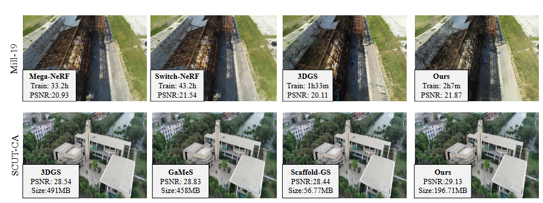
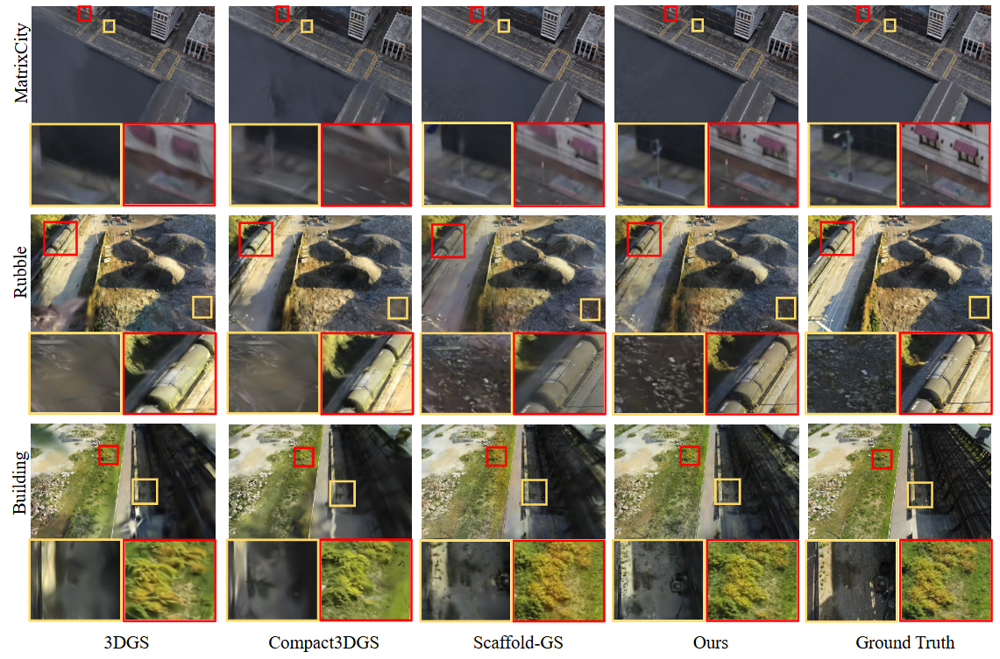
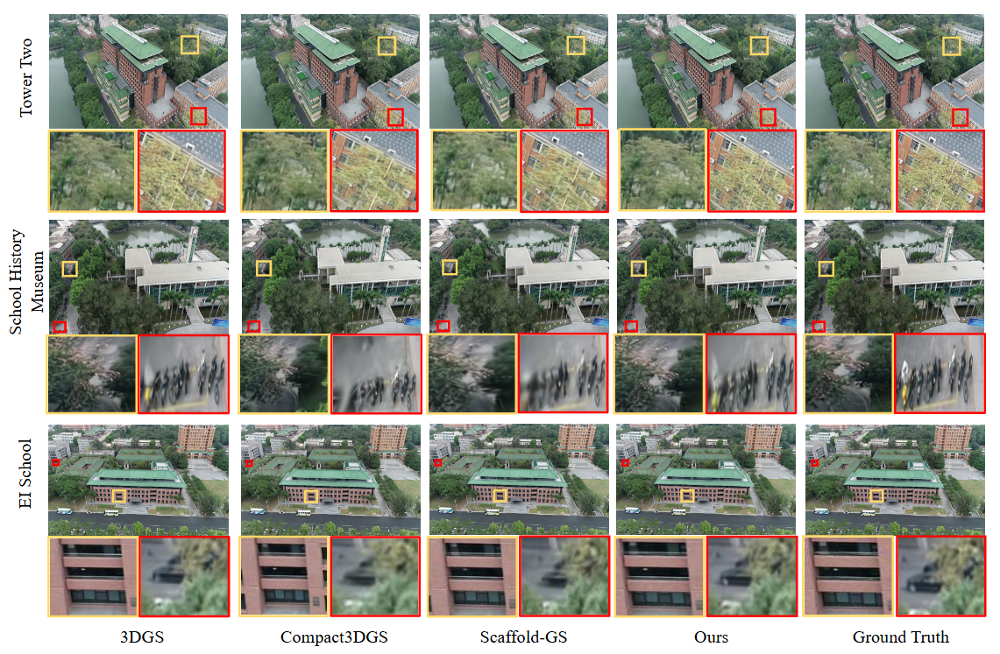
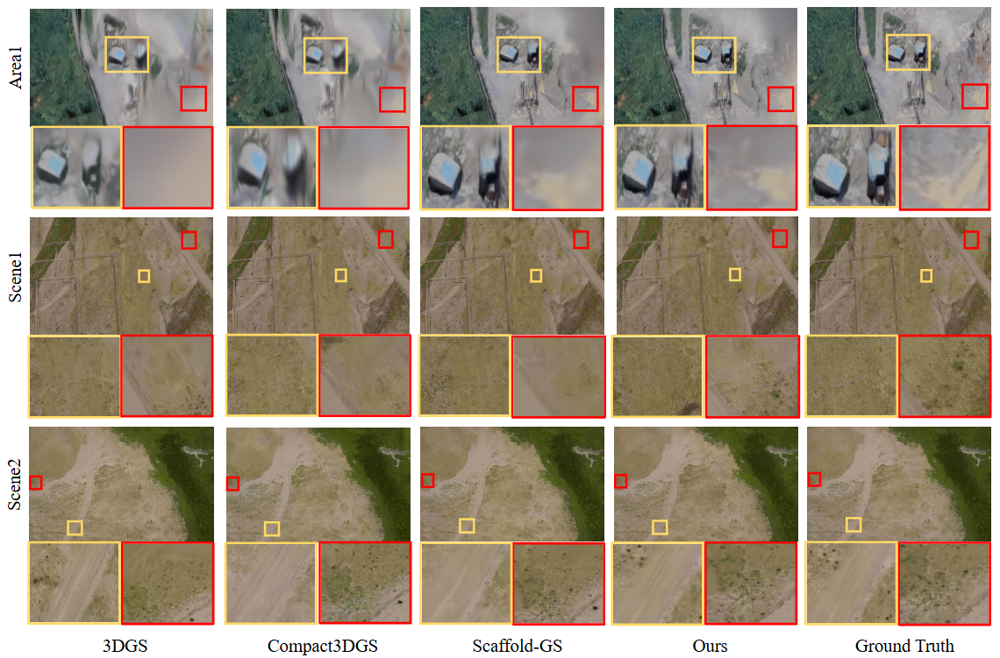

<p align="center">
<h1 align="center"><strong>Geometry-Aware 3D Gaussian Representation for Real-Time Rendering of Large-Scale Scenes</strong></h1>

## Overview

In this paper, we introduce a geometry-aware real-time rendering method for large-scale scenes. Compared to previous NeRF-based methods (such as Mega-Nerf and Switch-NeRF) and 3DGS-based methods (including 3DGS, GaMeS, and Scaffold-GS), our method renders large scenes with high fidelity while maintaining reasonable training time and memory usage. Extensive experiments on 13 scenes, including eight from four public datasets (MatrixCity-Aerial, Mill-19, Tanks & Temples, WHU) and five self-collected scenes from SCUT-CA and plateau regions, further demonstrate the generalization capability of our method. 

<p align="center">

</p>

## Dataset

We performe experiments on eight scenes from four public datasets from the Mega-NeRF, MatrixCity, 3D Gaussian Splatting and WHU dataset.

Mill-19 dataset:
Please download the data from the [Mega-NeRF](https://github.com/cmusatyalab/mega-nerf)

MatrixCity-Aerial dataset:
Please download the data from the [MatrixCity](https://city-super.github.io/matrixcity/)

Tanks & Temples dataset:
Please download the data from the [3D Gaussian Splatting](https://repo-sam.inria.fr/fungraph/3d-gaussian-splatting/)

WHU dataset:
Please download the data from the [WHU dataset](http://gpcv.whu.edu.cn/data/)

We performe experiments on five self-collected scenes(SCUT Campus and plateau regions).

Please concat us:

Haihong Xiao and Jianan Zou: auhhxiao@mail.scut.edu.cn; 202130450216@mail.scut.edu.cn

Prof. Wenxiong Kang: auwxkang@scut.edu.cn

## Installation

We tested on a server configured with Ubuntu 20.04, cuda 11.8 and gcc 9.4.0. Other similar configurations should also work, but we have not verified each one individually.

1. Clone this repo:

```
git clone https://github.com/SCUT-BIP-Lab/Geo_gs.git
cd Geo_gs
```

2. Install dependencies

```
conda create -n Geo_gs python=3.8
conda activate Geo_gs
pip install torch==1.12.1+cu113 torchvision==0.13.1+cu113 torchaudio==0.12.1 --extra-index-url https://download.pytorch.org/whl/cu113
pip install -r requirements.txt
```

3、Data preparation

First, create a ```data/``` folder inside the project path by 

```
mkdir data
```

The data structure will be organised as follows:

```
data/
├── dataset_name
│   ├── scene1/
│   │   ├── images
│   │   │   ├── IMG_0.jpg
│   │   │   ├── IMG_1.jpg
│   │   │   ├── ...
│   │   ├── sparse/
│   │       └──0/
│   ├── scene2/
│   │   ├── images
│   │   │   ├── IMG_0.jpg
│   │   │   ├── IMG_1.jpg
│   │   │   ├── ...
│   │   ├── sparse/
│   │       └──0/
...
```

## Quick Start(MatrixCity-Aerial dataset)

You can quickly train the model and obtain test results on MatrixCity-Aerial dataset using the following command:

```
conda activate Geo_gs
cd Geo_gs
bash single_train.sh
```

## Training and Evaluation

You can run other scene datasets by either modifying the previous bash file or executing the following command. For specific file modifications, please contact us [Haihong Xiao](auhhxiao@mail.scut.edu.cn) and [Jianan Zou](202130450216@mail.scut.edu.cn), and we will provide assistance.

```
conda activate Geo_gs
cd Geo_gs
python train.py -s <path to COLMAP or NeRF Synthetic dataset>　--eval # Train with train/test split
python render.py -m <path to trained model>
python metrics.py -m <path to trained model>
```

## Results

Visual comparisons on Mill-19 and MatrixCity dataset:

<p align="center">

</p>

Visual comparisons on SCUT_CA outdoor scenes:

<p align="center">

</p>

Visual comparisons on WHU dataset and Plateau Region scenes:

<p align="center">

</p>

## Acknowledgements

Our code follows several awesome repositories. We appreciate them for making their codes available to public.

[Mega-NeRF](https://github.com/cmusatyalab/mega-nerf)

[Switch-NeRF](https://github.com/MiZhenxing/Switch-NeRF)

[3DGS](https://github.com/graphdeco-inria/gaussian-splatting) 

[GaMeS](https://github.com/waczjoan/gaussian-mesh-splatting) 

[Compact3DGS](https://github.com/maincold2/Compact-3DGS) 

[Scaffold-GS](https://github.com/city-super/Scaffold-GS) 
